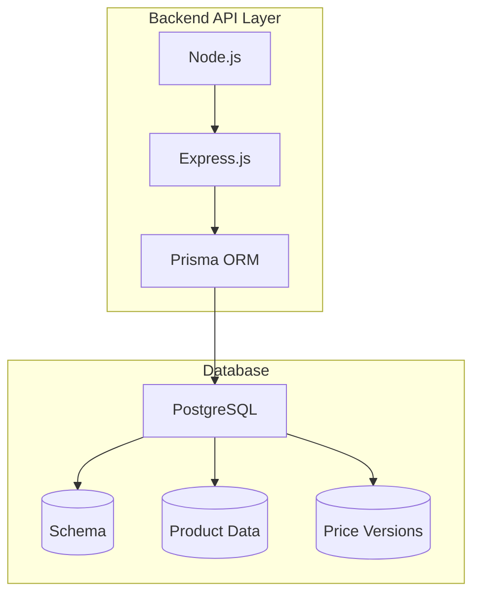

# mock-store-payment-backend

A backend service for a mock store and payment system.  
It demonstrates common backend patterns such as authentication, product catalog, order management, and integration with a mock payment service.  

This project is intended as a backend showcase and learning exercise, not for production use.


## Features
- User registration and login with JWT authentication
- Product catalog to browse available item
- Order creation with snapshot pricing
- Integration with a mock payment service
- Secure payment callback handling
- Order history per user

## Tech Stack
- Backend: NodeJS
- Database: PostgreSQL
- API: REST (gRPC optional for internal service calls)
- Authentication: JWT
- Deployment: Docker



## Project Structure
```bash
mock-store-payment-backend/
├── src/
│   ├── api/
│   │   ├── index.js         # Express app
│   │   ├── routes/
│   │   │   ├── products.js
│   │   │   ├── bundles.js
│   │   │   ├── users.js
│   │   │   └── orders.js
│   │   └── controllers/     # 
│   ├── db/
│   │   ├── migrations/
│   │   ├── data/
│   │   └── operation/
│   └── prisma/
│       └── schema.prisma    # Prisma schema
│
├── package.json
└── README.md
```
