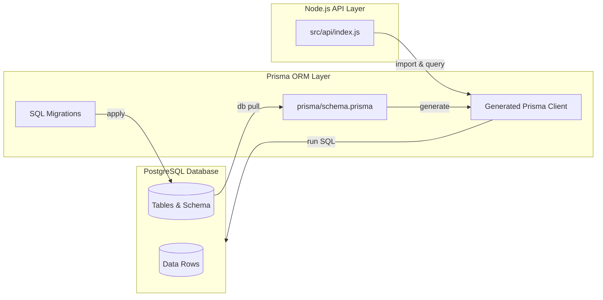
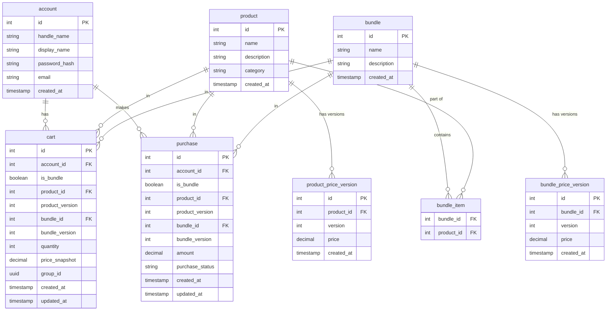

# mock-store-payment-backend


A learning-oriented backend service inspired by game store platforms.
It explores common backend patterns including authentication, product catalog, cart and order management, and integration with a mock payment service.

This project serves as a showcase and practice ground for backend development concepts, not intended for production use.

Frontend is not within the scope of this project.

## ✨ Features

| Feature | Scope |
|--|--|
| User Management | <ul><li>Create a new account</li><li>Log in</li><li>Delete own account</li></ul> |
| Product Query | <ul><li>Query individual products via API endpoint</li><li>Retrieve product prices</li></ul> |
| Shopping Cart | <ul><li>View cart contents</li><li>Add items to the cart</li><li>Delete items in the card</li></ul> |
| Checkout & Payment | <ul><li>Checkout selected items from the cart</li><li>Process payment through a mock payment API</li></ul> |
| Transactions & Invoices | <ul><li>Record user payments</li><li>Generate invoices (e.g., as PDF)</li></ul> |

## pending-demo


## Project Structure

```bash
mock-store-payment-backend/
├── prisma/                 # Prisma schema & migrations
├── scripts/                # Windows batch scripts (reset-db, reset-data, etc.)
├── src/
│   └── api/                # Express API endpoints
├── .env                    # Example environment variables. Disensitized version config is pushed in this repo.
├── .pgpass                 # Local PostgreSQL password config
├── package.json
└── README.md
```

## Tech Stack

- Database: `PostgreSQL`
- ORM: `Prisma`
- API Framework: `Node.js` + `Express`
- Configuration: `dotenv`, `pgpass`
- Automation: Windows batch scripts for database reset/init/load




> Disclaimer: `Node.js` was chosen over `C++` as it is more commonly used for backend services in Singapore. The project serves to align with prevalent industry practices and to build familiarity with widely adopted backend methodologies.

## Database ERD

