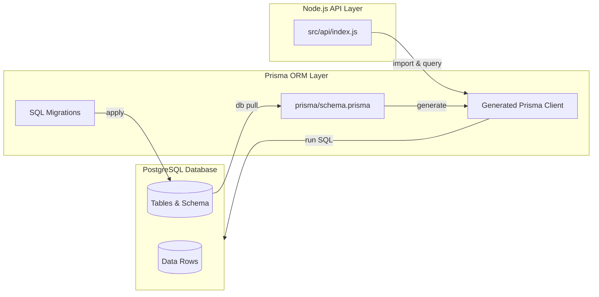

# mock-store-payment-backend

A backend service for a mock store and payment system.  
It demonstrates common backend patterns such as authentication, product catalog, order management, and integration with a mock payment service.  

This project is intended as a backend showcase and learning exercise, not for production use.


## Purpose

**Learning goal**: Explore backend endpoint development with Node.js + Express, and practice connecting APIs to a database through an ORM.

**Business simulation**: Mimic the data flow of an e-commerce platform or in-game store (account, product, bundle, purchase, payment, price versioning, etc).

**Common challenges**: Handle typical backend concerns such as account management, schema evolution, data initialization/reset, and pricing logic.

## Feature Scope
| Feature | Scope |
|--|--|
| User Management | <ul><li>Create a new account</li><li>Log in</li><li>Delete own account</li></ul> |
| Product Query | <ul><li>Query individual products via API endpoint</li><li>Retrieve product prices</li></ul> |
| Shopping Cart | <ul><li>View cart contents</li><li>Add items to the cart</li><li>Delete items in the card</li></ul> |
| Checkout & Payment | <ul><li>Checkout selected items from the cart</li><li>Process payment through a mock payment API</li></ul> |
| Transactions & Invoices | <ul><li>Record user payments</li><li>Generate invoices (e.g., as PDF)</li></ul> |
    

Do take note that this project focus on endpoint API, not frontend capabilities.

## Tech Stack

- Database: `PostgreSQL`
- ORM: `Prisma`
- API Framework: `Node.js` + `Express`
- Configuration: `dotenv`, `pgpass`
- Automation: Windows batch scripts for database reset/init/load



## Project Structure

```bash
mock-store-payment-backend/
├── prisma/                 # Prisma schema & migrations
├── scripts/                # Windows batch scripts (reset-db, reset-data, etc.)
├── src/
│   └── api/                # Express API endpoints
├── .env                    # Example environment variables. Disensitized version config is pushed in this repo.
├── .pgpass                 # Local PostgreSQL password config
├── package.json
└── README.md
```
